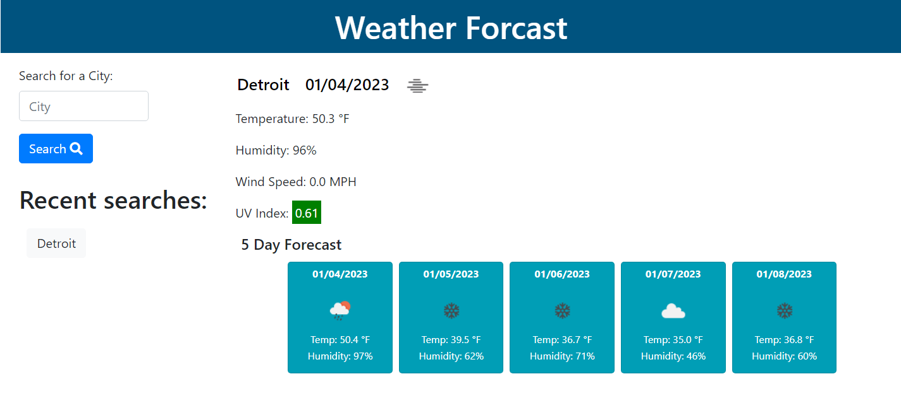

#  Third-Party APIs: Weather Forcast
https://jalilyosufi.github.io/Weather-forecast/
git 
Simple weather forecast application that allow user to search for weather forecast of any city or country. This app will run in the browser and feature dynamically update HTML and CSS powered by jQuery.

#  User Story
```text
As a employer, student or traveler
I WANT to see the weather outlook for multiple cities
SO THAT I can plan a trip accordingly
```

## Acceptance Criteria

* Create a weather dashboard with form inputs.
  * When a user searches for a city they are presented with current and future conditions for that city and that city is added to the search history
  * When a user views the current weather conditions for that city they are presented with:
    * The city name
    * The date
    * An icon representation of weather conditions
    * The temperature
    * The humidity
    * The wind speed
  * When a user view future weather conditions for that city they are presented with a 5-day forecast that displays:
    * The date
    * An icon representation of weather conditions
    * The temperature
    * The humidity
  * When a user click on a city in the search history they are again presented with current and future conditions for that city

## Usage
The following image shows the web application's appearance and functionality:


- This weather forcast dashboard display weather forcast of any city you want to search.
- On the left side you can see a search bar which you can search the name of any city you want the weather forcast.
- On the right side you can see the current forcast of the searched city and 5 day of upcoming forcast.
- On the left side your search will be saved.
